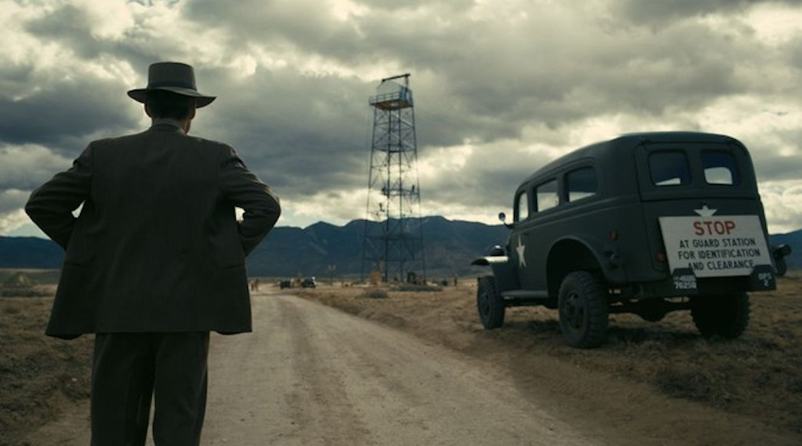

# The inevitable decision

>"You may not yet grasp the full scope of a world reshaped by exponential innovation—its digital capabilities rewriting every playbook, its cultural revolutions tearing down every old rule. But here is what you cannot afford: to sit idle while the future of business is decided without you. In the new order of social norms, hesitation is surrender, and indecision is nothing less than self-inflicted obsolescence."

| Oppenheimer |
| :---: |
||
|Now I am become Death, the destroyer of worlds.|

>Oppenheimer didn’t have the luxury of time. Faced with irreversible change, he made a decision that forever altered the trajectory of humanity. In today’s digital landscape, the technologies we unleash shape economies, societies, and values. You may not fully comprehend the chain reaction your choices trigger—but refusing to decide is itself a destructive force. Inaction isn’t neutral—it’s surrender.

Decision-making is no longer a managerial function—it is a survival skill. In today’s digital world, where innovation accelerates at breakneck speed and cultural shifts happen in real time, the ability to decide with clarity and conviction is the thin line between relevance and irrelevance.

The pace is relentless. Technologies emerge overnight. Entire industries morph in months. Social norms evolve faster than organizations can rewrite their policies. The businesses that survive are not always the ones with the most resources or the latest tech—they are the ones with leaders who can make the right call, at the right time, with the right intent.

And here’s the truth: the digital world offers an infinite canvas for innovation, growth, and disruption. But it is also a minefield of complexity, noise, and fleeting trends. The leader who hesitates, who endlessly evaluates without acting, is already falling behind. In the digital arena, paralysis is not caution—it is decay in motion.

Making decisions today is not about chasing the latest technology or jumping on every flashy trend. It is about vision—the ability to read the currents before they become waves, to see not just where your business stands, but where it could be if you act decisively. It is about having the courage to make bold moves when certainty is a luxury you will never have.

And courage in decision-making is not recklessness. It is the discipline of calculated risk—the recognition that inaction carries the heaviest price tag of all. The digital age rewards the brave and erases the hesitant. Waiting for perfect clarity is like waiting for a storm to end before setting sail: by the time the skies clear, the opportunity has passed.

The empowering reality? Decision-making is not a gift—it’s a muscle. It can be trained, refined, and strengthened. The more you practice making informed, timely choices, the sharper your instincts become. As a CEO, executive, or entrepreneur, this is not optional—it is your most valuable competitive edge.

In this era, leadership is defined less by the title on your business card and more by the decisiveness of your actions. The leaders who thrive are those who embrace uncertainty, use data and intuition as twin compasses, and rally their organizations toward a clear direction—even when the path ahead is still being built.

So, stand in the moment. Make the call. Take the shot. The digital age does not wait for you to feel ready. The future will be shaped by those who choose to shape it.

Your competitors are already moving. Markets are already shifting. The clock is already ticking. You can watch and react—or you can decide and lead.

The future is not something you stumble into. It is something you claim with conviction. Seize it before someone else does.

[<< previous](2-limbic_system_taking_over.md) | [next >>](4-retreat_to_gain_speed.md)
