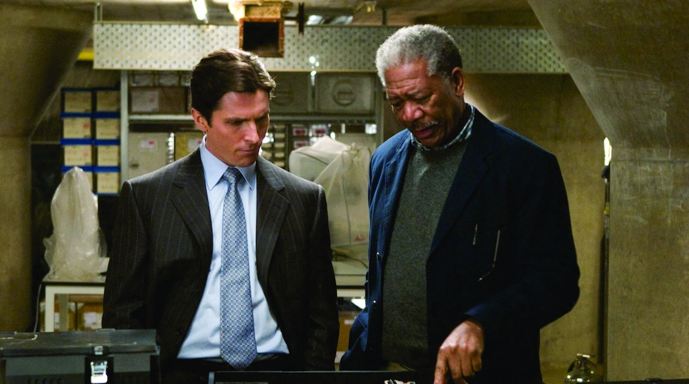

# Retreat to gain speed

>"There are moments when forward motion feels impossible, when progress stalls and the path ahead blurs into uncertainty. In those moments, the boldest move is not to push harder—it is to step back with intent. A retreat is not surrender; it is the gathering of strength, clarity, and momentum to launch further and faster than you ever could by charging off an enlightened future."

| Batman Begins |
| :---: |
||
|To conquer fear, you must become fear.|

>Bruce Wayne disappeared from the world not to escape it, but to reforge himself. In the shadows of his retreat, he studied, trained, and reshaped his very identity—returning not as a man, but as a symbol of unshakable purpose. In transformation, we too must sometimes retreat—not out of fear, but to regain control of our story. To step back is not to fall behind—it is to leap forward with precision, velocity, and vision.

Retreating to gain speed is not a sign of weakness—it is one of the most strategic moves a leader can make. In a world driven by relentless change and digital acceleration, the pressure to move faster can push leaders into reactive, short-sighted decisions. But the reality is this: sometimes, the fastest way forward begins by stepping back.

In today’s fast-paced and unforgiving digital economy, the most effective leaders deliberately carve out time for reflection—time to pause, evaluate, and recalibrate, relying back on purpose, principles and values to build the next move. They know that slowing down with purpose is the only way to ensure that when they move again, they move decisively, with greater force and precision.

Reflection is not a luxury—it is a competitive necessity.

It provides perspective on where you’ve been, clarity on where you stand, and insight into where you must go next. Reflection helps you uncover the patterns behind your successes and failures, understand the lessons embedded in both, and translate that understanding into sharper strategies. It’s the difference between navigating by instinct alone and steering with a complete, well-lit map.

In the context of digital transformation, reflection becomes even more critical. The digital landscape is not static—it shifts under your feet. Technologies evolve, market conditions change, and consumer expectations rise. Without deliberate pauses to assess and learn, organizations risk charging ahead down the wrong path, exhausting resources in the process.

The first step in retreating to gain speed is brutal honesty about your current state. That means looking deeply into your organization’s culture, processes, technologies, and leadership habits. What’s working? What’s slowing you down? Where are you simply repeating patterns without questioning their value? These questions demand transparency and openness to uncomfortable truths.

From this clarity comes the second step: identifying growth opportunities. That might mean venturing into new markets, rethinking your product portfolio, or dismantling outdated processes that no longer serve your purpose. The goal is not incremental change—it’s bold, decisive moves that position the organization for exponential growth.

But a retreat is not just about strategy—it’s about culture.

A company that treats retreat as a moment to regroup also uses it to foster innovation. Leaders who encourage experimentation, risk-taking, and open dialogue build organizations that can pivot fast and adapt without fear. They turn reflection into a creative engine—one that harnesses the collective intelligence of the workforce to discover new possibilities.

Employee engagement is the accelerant in this process. Bringing employees into the conversation, asking for their insights, and acting on their feedback builds trust and ownership. People support what they help create. A retreat that includes them becomes a rallying point, not a top-down directive.

Of course, no reflection is complete without a sharp eye on the competition and market trends. The speed of the digital age means your competitive landscape can change in months or even weeks. Retreating gives you the bandwidth to scan the horizon, anticipate shifts, and be ready to pivot before you’re forced to.

In essence, retreating to gain speed is about making a conscious choice to pause before you accelerate—to reload the spring before unleashing it. It’s about building momentum deliberately, so that when you surge forward, it’s not just fast—it’s unstoppable.

The world will keep moving, with or without you. But leaders who understand the power of the retreat know that it’s not about keeping pace—it’s about setting the pace.

So take the step back. Sharpen your vision. Engage your people. Build your momentum. And when you launch forward again, make it count.

[<< previous](3-the_inevitable_decision.md) | [next >>](5-building_from_purpose.md)
